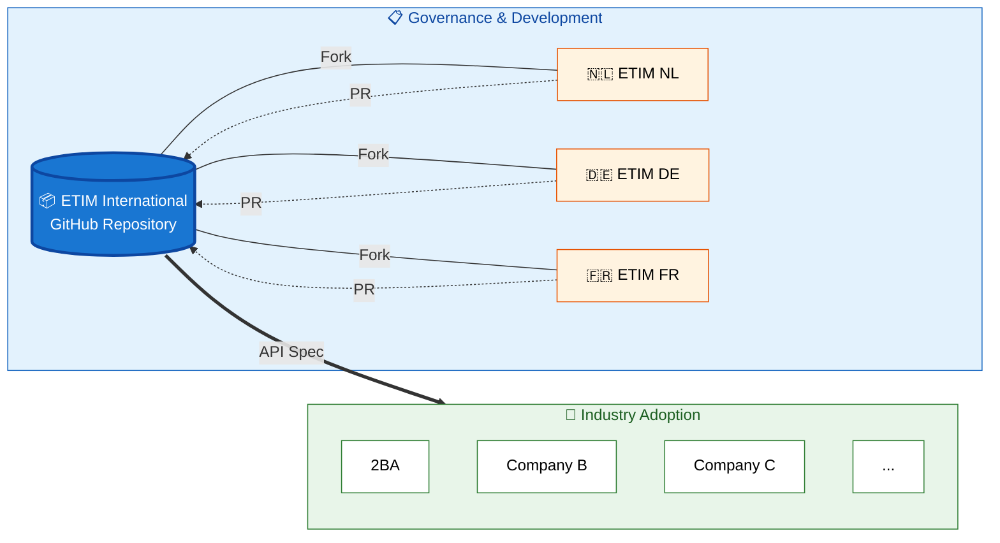

# 2BA ETIM xChange OpenAPI

This repository contains the OpenAPI 3.1 specifications for the 2BA (Building Blocks Architecture) ecosystem. It provides comprehensive API documentation for multiple domains including product information, trade items, pricing data, and ETIM classification standards.

## Purpose

The repository serves as the central source of truth for API specifications used across the branch, enabling:

- **Standardized API Documentation**: Consistent OpenAPI 3.1 specifications across all services
- **Code Generation**: Support for automatic client and server code generation
- **Contract-First Development**: API-first approach ensuring consistent interfaces
- **Cross-Domain Integration**: Unified specifications for product data, pricing, and classification systems

## GitHub - ETIM Int - Countries - Companies

## Repository Structure

The repository is organized into domain-specific API specifications with shared components for common schemas, parameters, and responses. Each API domain maintains its own OpenAPI specification while leveraging reusable components from the shared library.

## Documentation

### Getting Started
- [Initial Setup](docs/initial-setup.md) - How to set up and work with the OpenAPI specifications
- [Best Practices](docs/best-practices.md) - Guidelines for maintaining and extending the specifications
- [Design decisions](docs/etim-xchange-openapi-design-decisions.md) - General design decisions API vs ETIM xChange

### API Documentation
- [Product API](openapi/apis/product/README.md) - Core product information and catalog management
- [Trade Item API](openapi/apis/tradeitem/README.md) - Trade item specifications and relationships
- [Net Price API](openapi/apis/netprice/README.md) - Pricing and commercial data management

### Development Guidelines
- [Copilot Instructions](.github/copilot-instructions.md) - GitHub Copilot configuration for this repository