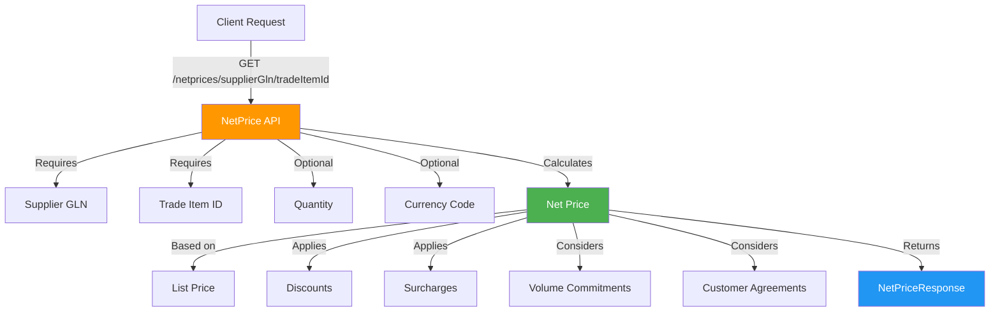
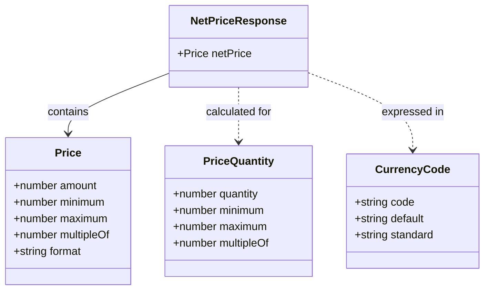
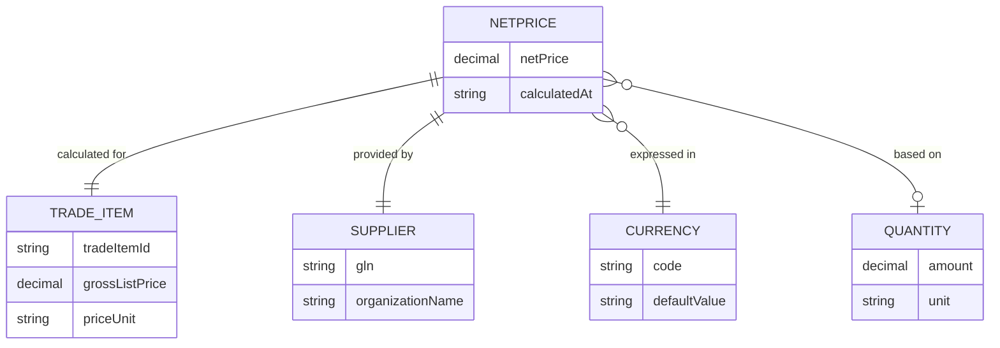
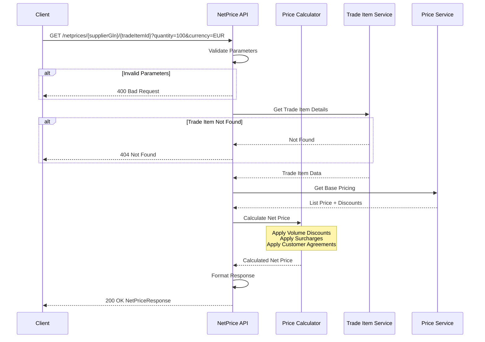

# NetPrice API Domain Model

## Overview

The NetPrice API manages customer-specific pricing, price lists, and discount structures for personalized pricing strategies. It provides advanced pricing calculations based on customer relationships, volume commitments, and commercial agreements.

**Net prices are calculated/derived resources**, not stored data, so having them as a separate resource is the right REST approach:

### **Why This Works:**

1. **Separate Concern** - Net prices are computed (from list price - discounts + surcharges)
2. **Different Lifecycle** - Trade items are stored entities, net prices are calculations
3. **Business Logic Separation** - The calculation logic is independent from trade item CRUD operations

### **REST Pattern You're Using:**
```
GET /netprices/{supplierGln}/{tradeItemId}
```

This is actually a **good REST design** because:
- ✅ Represents a **calculated/virtual resource**
- ✅ Clearly different from `/tradeitems` (stored data)
- ✅ Requires both `supplierGln` and `tradeItemId` for calculation context
- ✅ Read-only by nature (you calculate, not store)

### **Real-World Analogy:**
Similar to:
- `/search` - virtual resource from query
- `/reports` - generated from data
- `/calculations` - computed results

**Your architecture is sound!** The naming clearly indicates this is a special, calculated resource distinct from regular trade item prices. Keep it as is! 👍


## Domain Model

### NetPrice Resource Flow



### NetPrice Response Structure



### NetPrice Calculation Context



### Request/Response Flow



### Key Characteristics

- **Virtual Resource**: Net prices are calculated on-demand, not stored
- **Context-Dependent**: Requires supplier GLN and trade item ID
- **Quantity-Aware**: Supports volume-based pricing
- **Multi-Currency**: Defaults to EUR, supports ISO 4217 codes
- **High Precision**: Uses 4 decimal places (0.0001 precision)
- **Read-Only**: GET operations only (no POST/PUT/DELETE)
- **Business Logic**: Incorporates discounts, surcharges, and customer agreements

## Related Documentation

- [TradeItem API Documentation](../tradeitem/README.md)
- [Product API Documentation](../product/README.md)
- [Best Practices](../../../docs/best-practices.md)