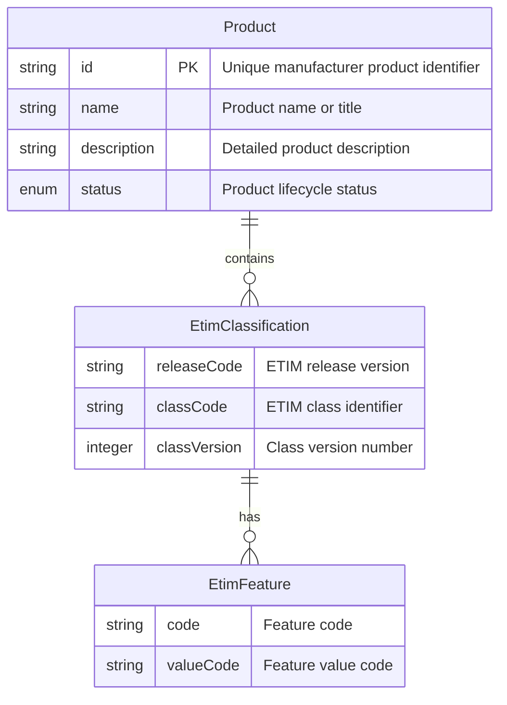
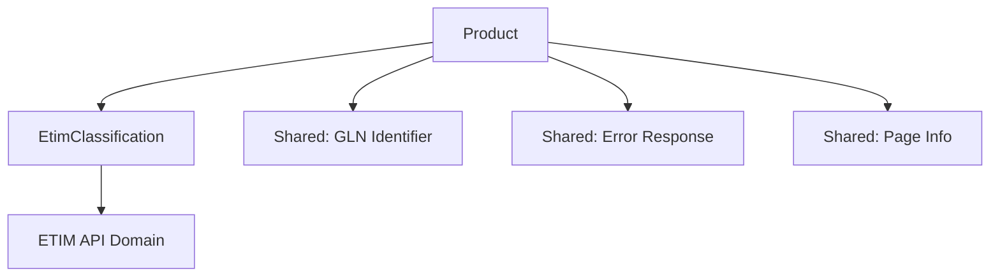
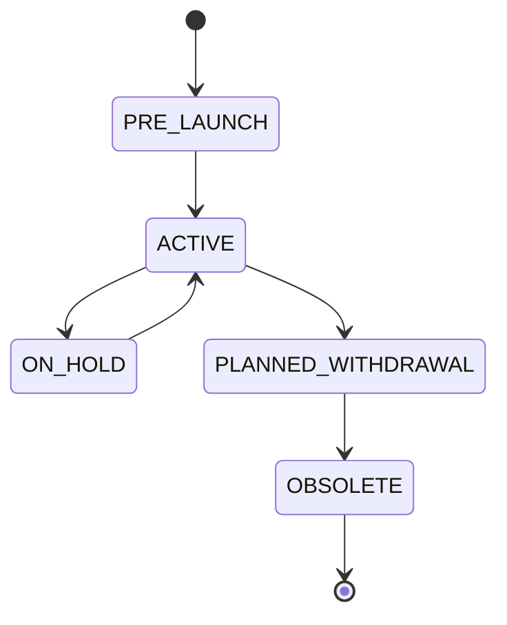

# Product API Domain Model

## Overview

The Product API manages manufacturer product specifications with ETIM classification data based on ETIM xChange V2.0. Products represent the manufacturer's perspective of items with comprehensive technical specifications, standardized classifications, legislation compliance, and lifecycle assessment data.

This API provides both individual product operations and bulk data retrieval with cursor-based pagination for high-volume synchronization scenarios.

## Domain Model



## Entity Details

### Product
- **File**: [`product.yaml`](schemas/domain/product.yaml)
- **Purpose**: Core product entity from manufacturer perspective
- **Key Properties**:
  - `id`: Unique manufacturer product identifier (max 35 chars)
  - `name`: Product name/title (max 255 chars)
  - `description`: Detailed description (max 4000 chars)
  - `status`: Lifecycle status (PRE-LAUNCH, ACTIVE, ON_HOLD, PLANNED_WITHDRAWAL, OBSOLETE)
  - `etimClassifications`: Array of ETIM classification data

### ETIM Classification
- **File**: `etim-classification.yaml` *(referenced)*
- **Purpose**: Standardized technical specifications following ETIM standards
- **Integration**: Links to ETIM API for classification data

## API Operations

### Individual Product Operations

| Endpoint | Method | Description |
|----------|--------|-------------|
| `/products` | GET | List all products with pagination |
| `/products/{id}` | GET | Get specific product by manufacturer ID |

### Bulk Operations

All bulk endpoints support cursor-based pagination and filtering by `selectionId`, `manufacturerIdGln`, and `mutationDate`.

| Endpoint | Method | Description | Use Case |
|----------|--------|-------------|----------|
| `/bulk/products` | GET | Retrieve complete product data | Full product synchronization |
| `/bulk/product-identifications` | GET | Retrieve identification data only | Lightweight product lookup tables |
| `/bulk/product-details` | GET | Retrieve descriptions and status | Product catalog synchronization |
| `/bulk/product-etim-classifications` | GET | Retrieve ETIM classifications | ETIM technical specification synchronization |

#### Pagination Parameters

- `cursor` (optional): Opaque pagination token for next/previous page
- `limit` (optional): Page size (default: 100, max: 1000)

#### Filter Parameters

- `selectionId` (optional): Filter by selection identifier
- `manufacturerIdGln` (optional): Filter by manufacturer GLN (13-digit)
- `mutationDate` (optional): Filter by last modification date (ISO 8601 date format)

#### Response Format

```json
{
  "data": [...],
  "meta": {
    "cursor": "eyJpZCI6MTIzfQ==",
    "hasNext": true,
    "hasPrev": false,
    "limit": 100,
    "estimatedTotal": 1523
  }
}
```

## Dependencies



## Data Model Details

### Key Identification Fields

Products are uniquely identified by the composite key:
- `manufacturerIdGln` (GLN - 13 digits) + `manufacturerProductNumber` (max 35 chars)

Alternative identifiers:
- `manufacturerIdDuns` (DUNS - 9 digits)
- `productGtins` (array of GTIN-8/12/13/14)

### Product Lifecycle

Products have lifecycle dates:
- `productAnnouncementDate`: Official announcement
- `productValidityDate`: Start of sales validity
- `productObsolescenceDate`: Obsolescence/end of life

### Complex Nested Structures

- **ProductDescriptions**: Multilingual (minimal, unique, full, marketing, specifications)
- **ProductRelations**: Related products (accessories, spare parts, successors, etc.)
- **ProductAttachments**: Documents, images, videos with type codes (ATX001-ATX099)
- **EtimClassifications**: ETIM classes with feature values
- **Legislation**: RoHS, REACH, WEEE, CE marking, hazardous materials
- **LcaEnvironmental**: Life Cycle Assessment and EPD data

### Numeric Fields

All ETIM xChange string-based numeric fields are converted to proper `number` type:
- Supports up to 4 decimal places (`multipleOf: 0.0001`)
- Examples: `factorCustomsCommodityCode`, `declaredUnitQuantity`, `netWeightHazardousSubstances`

### Nullable Fields

OpenAPI 3.1 pattern used: `type: ["string", "null"]` (not `nullable: true`)

## Example Usage

### Complete Product Example

```json
{
  "manufacturerIdGln": "1234567890123",
  "manufacturerName": "Philips Lighting B.V.",
  "manufacturerShortname": "Philips",
  "manufacturerProductNumber": "929002376910",
  "productGtins": ["8718699673826"],
  "brandName": "Hue",
  "productStatus": "ACTIVE",
  "productType": "PHYSICAL",
  "customisableProduct": false,
  "warrantyConsumer": 24,
  "productDescriptions": [
    {
      "descriptionLanguage": "en-GB",
      "minimalProductDescription": "LED Smart Bulb E27",
      "uniqueMainProductDescription": "Philips Hue White and Color Ambiance E27 LED Smart Bulb",
      "productKeyword": ["smart lighting", "LED", "color", "Bluetooth"]
    }
  ],
  "etimClassifications": [
    {
      "etimReleaseVersion": "10.0",
      "etimClassCode": "EC002745",
      "etimClassVersion": 1,
      "etimFeatures": [
        {
          "etimFeatureCode": "EF000123",
          "etimValueCode": "EV000789"
        }
      ]
    }
  ]
}
```

### Bulk Request Example

```bash
GET /bulk/products?limit=100&manufacturerIdGln=1234567890123&mutationDate=2024-01-01
```

### Bulk Response Example

```json
{
  "data": [
    {
      "manufacturerIdGln": "1234567890123",
      "manufacturerName": "Philips Lighting B.V.",
      "manufacturerProductNumber": "929002376910",
      ...
    }
  ],
  "meta": {
    "cursor": "eyJpZCI6MTIzfQ==",
    "hasNext": true,
    "hasPrev": false,
    "limit": 100,
    "estimatedTotal": 1523
  }
}
```

## Status Lifecycle



## Specifications

- **OpenAPI Spec**: `openapi.yaml` (includes bulk endpoints)
- **Bulk-Only Spec**: `openapi-bulk.yaml` (dedicated bulk operations spec)
- **ETIM xChange Source**: V2.0 Product schema (lines 319-1688, excluding TradeItem)

## Schemas Directory Structure

```
schemas/
├── domain/                               # Domain models
│   ├── Product.yaml                      # Main product entity (flattened)
│   ├── ProductDescription.yaml
│   ├── ProductRelation.yaml
│   ├── RelatedProduct.yaml
│   ├── ProductAttachment.yaml
│   ├── AttachmentDetails.yaml
│   ├── EtimClassification.yaml
│   ├── EtimFeature.yaml
│   ├── Legislation.yaml
│   ├── LcaEnvironmental.yaml
│   ├── LcaDeclaration.yaml
│   ├── ProductCountrySpecificField.yaml
│   ├── ProductIdentificationSummary.yaml # Bulk identification response
│   ├── ProductDetailsSummary.yaml        # Bulk details response
│   └── ProductEtimClassificationsSummary.yaml # Bulk ETIM classifications response
├── enums/                                # Enumerations
│   ├── ProductStatus.yaml
│   ├── ProductType.yaml
│   ├── ProductRelationType.yaml
│   ├── AttachmentType.yaml
│   ├── AttachmentTypeSpecification.yaml
│   └── WeeeCategory.yaml
└── responses/                            # Response wrappers
    ├── ProductsResponse.yaml
    ├── BulkProductsResponse.yaml
    ├── BulkProductIdentificationsResponse.yaml
    ├── BulkProductDetailsResponse.yaml
    └── BulkProductEtimClassificationsResponse.yaml
```

## Best Practices

### When to Use Bulk Endpoints

- **Full Sync**: Use `/bulk/products` for complete product data synchronization
- **Lookup Tables**: Use `/bulk/product-identifications` for lightweight product ID mappings
- **Catalog Updates**: Use `/bulk/product-details` for description/status changes
- **ETIM Sync**: Use `/bulk/product-etim-classifications` for ETIM technical specifications

### Pagination Strategy

1. Start without cursor for first page
2. Use `meta.cursor` from response for next page
3. Continue until `meta.hasNext` is `false`
4. Handle `estimatedTotal` as approximation only

### Filtering Best Practices

- Use `mutationDate` for incremental synchronization
- Use `manufacturerIdGln` to sync specific manufacturer's products
- Combine filters for targeted data retrieval

### Error Handling

All endpoints return RFC 7807 Problem Details on errors:
- 400: Bad Request (invalid parameters)
- 401: Unauthorized (missing/invalid authentication)
- 403: Forbidden (insufficient permissions)
- 500: Internal Server Error

## Related Documentation

- [ETIM API Documentation](../etim/README.md)
- [Trade Item API Documentation](../tradeitem/README.md)
- [ETIM xChange Generation Prompt](../../../docs/etim-product-openapi-generation-prompt.md)
- [Best Practices](../../../docs/best-practices.md)