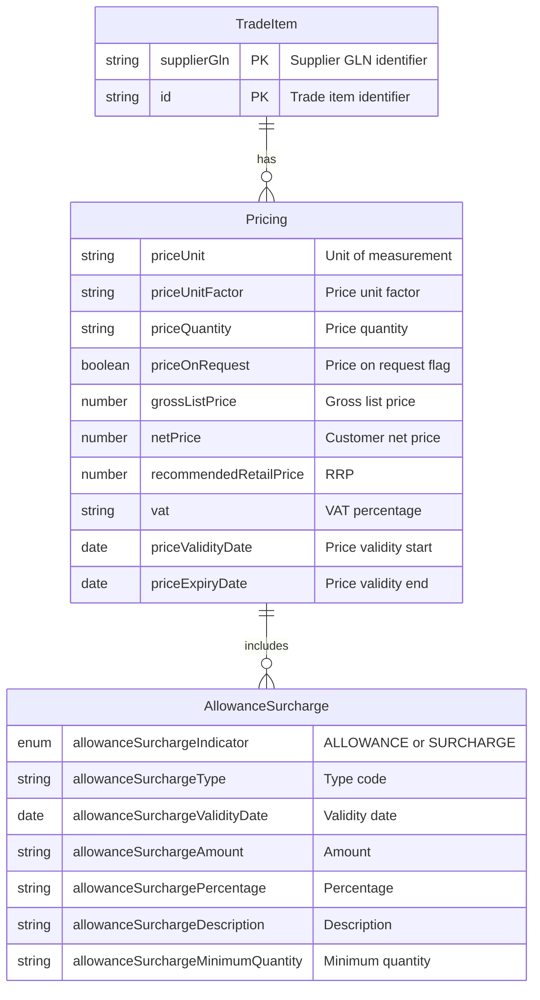
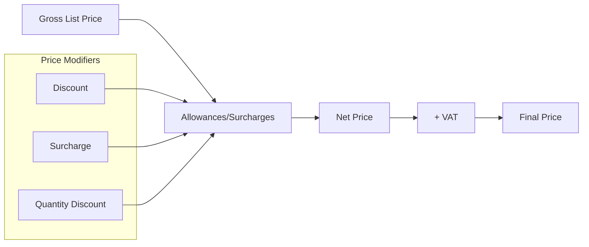
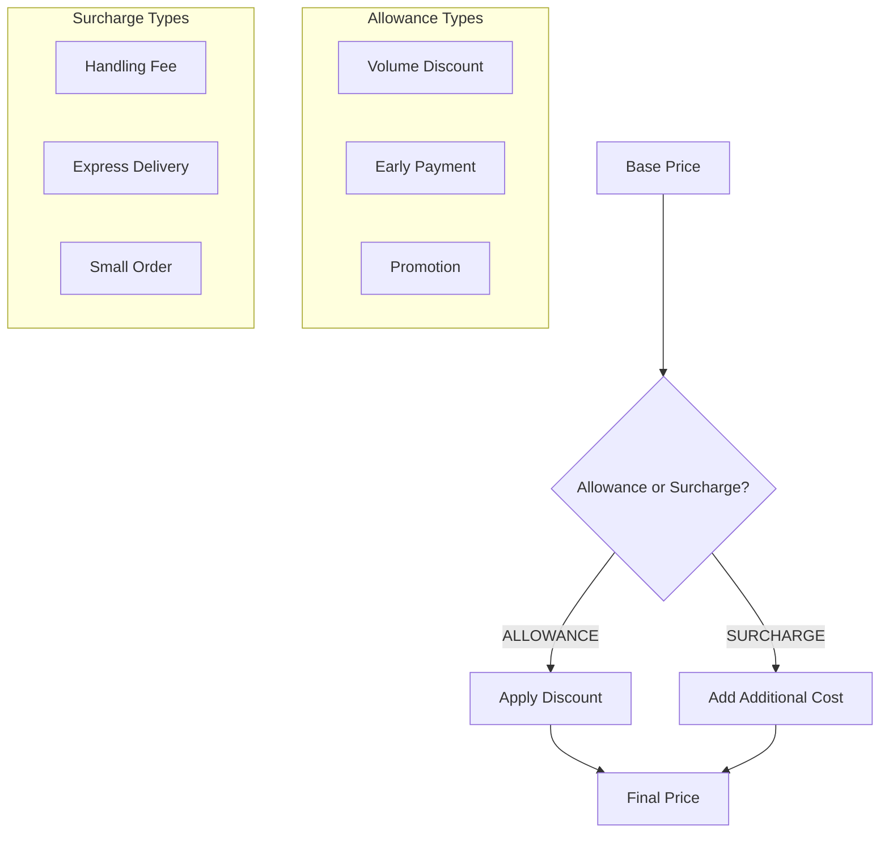
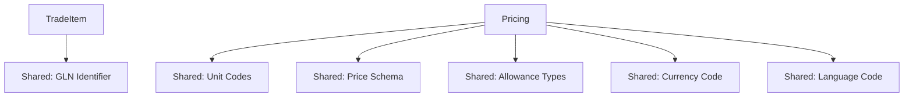
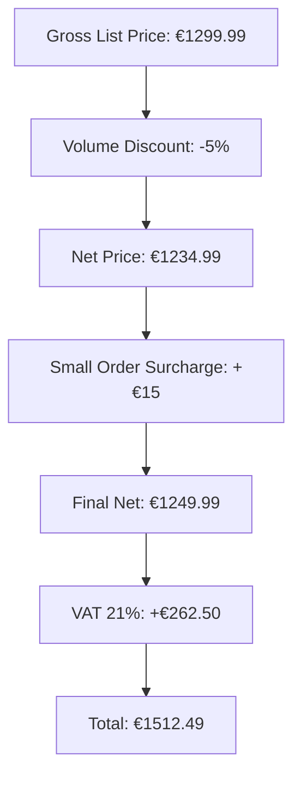

# TradeItem API Domain Model

## Overview

The TradeItem API manages supplier trade items with comprehensive pricing information. Trade items represent the supplier's offering of products with specific pricing, availability, and commercial terms.

The API supports both individual item operations and high-volume bulk operations based on the ETIM xChange V2.0 schema standard.

## Domain Model



## Entity Details

### TradeItem
- **File**: [`tradeitem-response.yaml`](schemas/responses/tradeitem-response.yaml)
- **Purpose**: Supplier's commercial offering of products
- **Key Properties**:
  - `supplierGln`: GLN identifier for the supplier
  - `id`: Trade item identifier (max 35 chars)
  - `pricings`: Array of pricing information

### Pricing
- **File**: [`pricing.yaml`](schemas/domain/pricing.yaml)
- **Purpose**: Comprehensive pricing and commercial terms
- **Key Features**:
  - Multiple price types (gross, net, RRP)
  - Unit-based pricing with factors
  - VAT calculations
  - Price validity periods
  - Allowances and surcharges

## Price Flow Diagram



## Allowance/Surcharge Flow



## API Operations

### Individual Item Operations

| Endpoint | Method | Description |
|----------|--------|-------------|
| `/tradeitems` | GET | List all trade items with pagination |
| `/tradeitems/{supplierGln}/item-number/{supplierItemNumber}` | GET | Get specific trade item by supplier item number |
| `/tradeitems/{supplierGln}/item-gtin/{itemGtin}` | GET | Get specific trade item by GTIN |
| `/pricings` | GET | List pricing information |

### Bulk Operations

The TradeItem API provides specialized bulk endpoints for high-volume data retrieval with cursor-based pagination:

| Endpoint | Method | Description | Use Case |
|----------|--------|-------------|----------|
| `/bulk/trade-items` | GET | Retrieve complete trade items in bulk | Full catalog synchronization |
| `/bulk/item-identifications` | GET | Retrieve item identifiers and GTINs only | Item mapping and cross-referencing |
| `/bulk/item-orderings` | GET | Retrieve ordering information only | Inventory and order management systems |
| `/bulk/item-pricings` | GET | Retrieve pricing information only | Price synchronization and updates |

#### Bulk Operations Features

- **Cursor-based pagination**: Efficient navigation through large datasets (default: 100, max: 1000 items per page)
- **Incremental synchronization**: Filter by `mutationDate` to retrieve only changed items
- **Selection-based filtering**: Use `selectionId` to retrieve predefined subsets
- **Supplier filtering**: Filter by `supplierIdGln` to get items from specific suppliers
- **Optimized payloads**: Specialized endpoints return only the data you need

#### Example: Bulk Trade Items Request

```bash
GET /bulk/trade-items?supplierIdGln=8712423012485&limit=100&mutationDate=2024-10-15
```

#### Example: Incremental Update Pattern

```bash
# Initial full synchronization
GET /bulk/trade-items?supplierIdGln=8712423012485&limit=1000

# Daily incremental updates (only items changed since yesterday)
GET /bulk/trade-items?supplierIdGln=8712423012485&mutationDate=2024-11-01&limit=500
```

See [`openapi-bulk.yaml`](openapi-bulk.yaml) for the complete bulk operations specification.

## Dependencies



## Example Usage

```json
{
  "supplierGln": "4012345000016",
  "id": "TI-MOTOR-001",
  "pricings": [
    {
      "priceUnit": "C62",
      "priceQuantity": "1.0000",
      "grossListPrice": "1299.99",
      "netPrice": "1199.99",
      "vat": "21.00",
      "priceValidityDate": "2025-01-01",
      "priceExpiryDate": "2025-12-31",
      "allowanceSurcharge": [
        {
          "allowanceSurchargeIndicator": "ALLOWANCE",
          "allowanceSurchargeType": "VOLUME_DISCOUNT",
          "allowanceSurchargePercentage": "5.00",
          "allowanceSurchargeMinimumQuantity": "10.0000"
        }
      ]
    }
  ]
}
```

## Price Calculation Example



## Related Documentation

- [Product API Documentation](../product/README.md)
- [NetPrice API Documentation](../netprice/README.md)
- [Best Practices](../../../docs/best-practices.md)